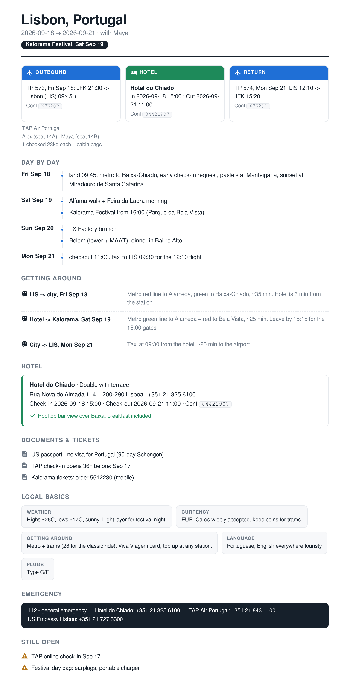

<div align="center">


# travel-planner

**your trips, briefed like you have an EA**

  

[What You Get](#what-you-get) • [Scheduled Jobs](#scheduled-jobs) • [Requirements](#requirements) • [Install](#install) • [Usage](#usage) • [Example Brief](#example-brief)

</div>

---

Your assistant can already search flights and look up destinations. What it can't do out of the box is remember how you travel, or hand you the one-page briefing an EA would prepare before you get on a plane. This plugin does both.

## What you get

- **A traveler profile**, drafted from your Gmail travel history and confirmed in one exchange: home airport, preferred carrier, miles programs, hotel budget, booking platform, card travel benefits, passport country.
- **Trip records** that persist across conversations: flights considered and booked, hotel shortlist, visa status, checklist. Planning resumes where it stopped, days later.
- **A trip brief**, 48 hours before every departure: flights with confirmation numbers, transfers with pickup times, hotel with check-in details, day-by-day plan, documents, local basics, emergency numbers. Rendered in-app, PDF'd, and emailed to you (and companions if you want). Decisions made, not options listed.

- **Change monitoring**: 3 days and 1 day out, your Gmail gets swept for gate changes, delays, and cancellations. If something changed you get an email with what changed and what it affects. No news, no email.
- **Calendar sync**: trip block plus flight events pushed to Google Calendar once booked.

## Scheduled jobs

The part you should read before installing. Once set up, the plugin acts on its own:

| When | What happens |
| --- | --- |
| Right after setup | Your assistant tells you what it found (profile, trips) and repeats this table in chat |
| 3 days + 1 day before a trip | Gmail swept for gate changes, delays, cancellations. Email alert only if something changed |
| 48 hours before departure | Trip brief generated and emailed to you, without being asked |
| When you book | Trip block + flight events pushed to your Google Calendar |

What it will never do on its own: book anything, spend money, or email anyone other than you (companions only get the brief if you say so).

## Requirements

Both are hard requirements. Without them the plugin can't do its job.

- **Gmail**: drafts your traveler profile from booking history, finds confirmations, watches for gate changes and delays, and sends you the trip brief.
- **Google Calendar**: blocks trip dates and adds flight events once something is booked.

## Install

```
assistant plugins install travel-planner
```

First use: the assistant scans your Gmail travel history, shows you the profile it drafted, and asks only for what email can't reveal (passport, miles programs, card benefits). Reminders are created automatically and stay silent unless there's something to say.

## Surfaces

| Surface | What it does |
| --- | --- |
| `get-travel-context` (tool) | Read profile + trip records before any planning |
| `update-profile` (tool) | Save durable travel preferences |
| `update-trip` (tool) | Create/update per-trip records |
| `generate-trip-brief` (tool) | Build the EA-style HTML brief from a trip record |
| `travel-planner` (skill) | The planning workflow: filter by profile, write back state, brief before departure |

Scheduled jobs (pre-trip monitoring, 48h brief send) are created through the assistant's built-in scheduler, same pattern as [Amex Perk Reminder](https://github.com/AnitaKirkovska/amex-perk-reminder).

## Usage

- "plan a trip to lisbon in september, 4 nights"
- "find flights but only ones where I earn my miles"
- "hotels under my usual budget, and check if any qualify for my card credit"
- "send me my trip brief"
- "where were we on the lisbon trip"
- "what trips do I have coming up"

## Cross-plugin: Amex Perk Reminder

If [Amex Perk Reminder](https://github.com/AnitaKirkovska/amex-perk-reminder) is installed, hotel shortlists get checked against your active Amex credits automatically.

## Example brief

Built from a fictional Lisbon trip. This is what lands in your inbox 48 hours before departure:



Or open the real thing: [brief-example.pdf](brief-example.pdf)

## License

MIT
